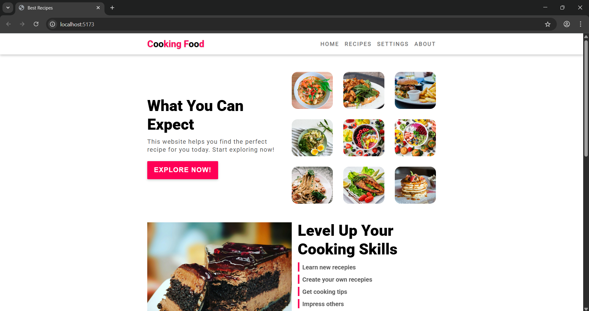
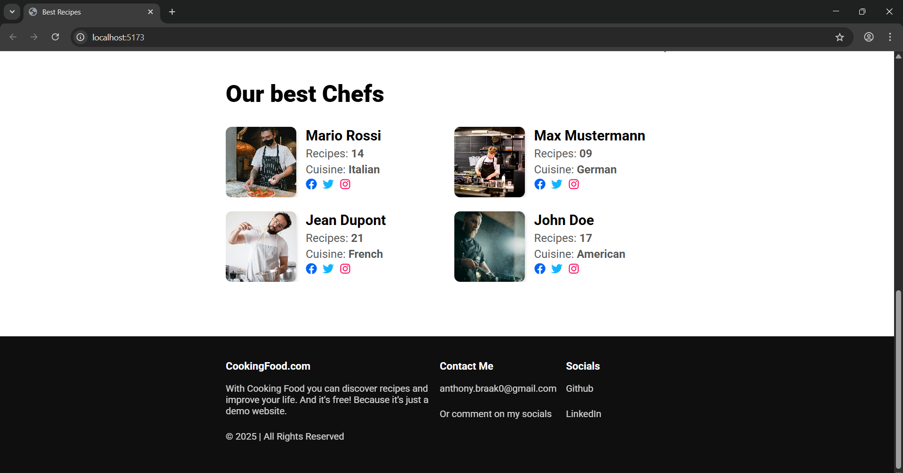
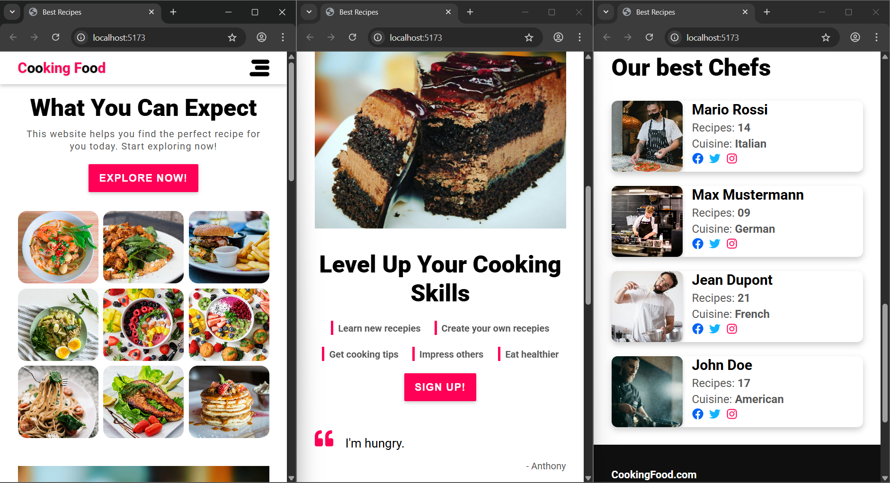

# CookingFood.com

A responsive recipe website built with **React**, **TypeScript**, and **SCSS**, designed to showcase a wide variety of dishes with smooth custom animations and clean UI components. Backend is handled with **Node.JS** and a **REST API**. Demo now deployed on [**Netlify**](https://react-food-blog.netlify.app/)!





---

## Feautures

- Search Functionality: Search recipes by keywords in the title or description

- Search History: Automatically remembers and displays your 5 most recent searches

- Recipe Browser: Browse a variety of recipes with images, authors, and descriptions

- Custom Theming: Easily adjust theme colors, font sizes, and animation speeds

- Responsive Design: Fully responsive layout optimized for mobile, tablet, and desktop

- Fast Frontend: Lightweight and performant frontend built with React and TypeScript

- Modular Codebase: Clean, maintainable, and scalable component-based architecture

- Smooth Animations: Custom SCSS-based transitions for a polished user experience

- REST API Integration: Recipes are dynamically loaded from a Node.js backend using Express

---

## Tech Stack

- **Frontend**: React 18, TypeScript

- **Styling**: SCSS (Sass)

- **Build Tool**: Vite

- **Backend**: Node.js, Express

- **API Communication**: REST API (JSON)

- **Code Quality**: ESLint, Prettier

- **Version Control**: Git, GitHub

## Getting Started

### Prerequisites

- Node.js (>= 16.x)
- npm

### Installation

```bash
# Clone the repo
git clone https://github.com/AnthonyBraak/react-food-blog.git
cd react-food-blog

# Install dependencies for both frontend and backend
npm install

# Run both frontend and backend servers concurrently
npm run dev
```

---

## Author

Anthony Braak

Feel free to connect on [LinkedIn](https://www.linkedin.com/in/anthony-braak-63b1b9371)

---

## Licence

This project is licenced under the MIT Licence
